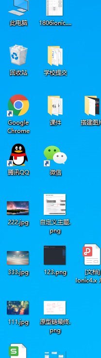

### 弹性布局

1. 任何一个容器都可以指定为flex(弹性布局)  行内元素也可以使用弹性布局 webkit的浏览器上必须加上-webkit前缀

   ```css
   .box{
    display:flex;
   }
   .box{
    display:inline-flex
   }
   .box{
    display:-webkit-flex;
    display:flex;
   }
   当一个元素设置为弹性布局以后 子元素的flat clear  vertical-align属性将失效
   ```

2. 采用Flex布局的元素 称为flex容器 简称容器  它的所有子元素自动称为容器成员 称为Flex项目 简称项目  容器默认存在两个轴 水平的主轴和垂直的交叉轴 主轴的开始位置叫做main start 结束的位置叫做main end 交叉轴的开始位置叫做cross start 结束位置叫做cross end 项目默认沿主轴排列 单个项目占据的主轴空间叫做main size 占据的交叉轴空间叫做cross size

3. 容器的属性   下面的6个属性设置在容器上

   ------

   - flex-direction   决定主轴的方向 （就是项目的排列方法）  

     ```
     row(水平从左到右) 默认值  最左边开始
     row-reverse（水平从右到左） 最右边开始
     column垂直从上到下         从顶部开始
     column-reverse 垂直从下到上  从底部开始
     ```

   - flex-wrap 默认情况下 项目都排列在一条线上  flex-wrap属性定义如果一条线拍不下 如何换行

     ```
     nowrap (默认值) 不换行
     wrap    换行  第一行在上方   放不下的新开一行
     wrap-reserve 换行 从容器的最底端开始排列 从下往上
     ```

     

   - flex-flow flex-flow属性是flex-direction（方向）属性和flex-wrap（换行）属性的简写形式  默认值为row nowrap

     ```
     .box{
     	flex-flow:  flex-direction|| flex-wrap
     }
     ```

     

   - justify-content  这个属性定义项目在主轴上的对齐方式

     ```
     flex-start   靠左对齐
     flex-end   	 靠右对齐
     center		 居中对齐
     space-between  两端对齐 项目之间的间隔都相等
     space-around   每个项目两侧的间隔相等 所以项目之间的间隔（两个项目都有间隔）与边框的间隔大一倍 
     
     ```

     

   - align-items   定义项目在交叉轴上（垂直方向）如何对齐

     ```
     flex-start 交叉轴的起点对齐
     flex-end   交叉轴的终点对齐
     center     交叉轴的中点对齐
     baseline   项目的第一行文字的基线对齐  以每个项目内部的第一行文字的基线对齐 
     strentch   默认值 如果项目没有设置高度或者设为auto 将占满整个容器的高度
     ```

     

   - align-content   这个属性定义了多根轴线的对其方式  如果项目只有一个轴线 该属性不起作用

     ```
     flex-start  与交叉轴的起点对齐  垂直方向往上顶 整体往上靠
     flex-end    与交叉轴的终点对齐  垂直放下往下靠 整体往下靠
     center      与交叉轴的中点对齐  整体居中
     space-between  与交叉轴两端对齐 轴线之间的间隔平均分布   上下顶头  其余均匀分布
     space-around   每根轴线两侧的间隔都相等 所以轴线之间的间隔比轴线与边框的间隔大一倍 全部均匀分布
     strentch     默认值 轴线占满整个交叉轴  
     
     ```

4. 项目的属性  以下6个属性设置在项目上

   ------

   - order 定义项目的排列顺序 数值越小 排列越靠前 默认值为0

     ```
     .item{
     order:<integer>
     }
     ```

     

   - flex-grow 定义项目的放大比例 默认值为0  如果存在剩余空间 也都不放大

     ```
     .item{
     flex-grow:<number>;   默认值为0
     }
     如果所有项目的flex-grow属性都为1  则他们将等分剩余空间(如果有剩余) 如果一个项目的flex-grow属性为2 其他项目都为1  则属性为2的占空间多一倍
     总结：默认的flex-grow属性的值均为0 表示都不会放大 我们可以手动的设置flex-grow属性 当项目在主轴方向或者交叉轴方向没有占满 存在剩余空间的时候 根据设置的整数值按照比例分配剩余的空间 假设剩余100px  那么就根据比例把这100px分配加到每个元素的宽度上
     ```

     

   - flex-shrink 定义了项目的缩小比例 默认值为1  即如果空间不足 该项目将缩小

     ```
     。item{
     	flex-shrink:< number>   默认值为1
     }
     如果所有项目的flex-shrink属性都为1 当空间不足时候 都将等比例缩小 如果一个项目的flex-shrink属性为0 其他项目都为1  空间不足的时候 项目的0的不缩小
     
     ```

     

   - flex-basic 定义了在分配多余空间之前 项目占据的主轴空间 浏览器根据这个属性 计算主轴是否有多余空间 它的默认值为auto 即项目本来的大小

     ```
     .item{
     flex-basis:<length>|auto
     }
     它可以跟设置width或height属性一样的值 比如350px  则项目将占据固定空间
     ```

     

   - flex  是flex-grow flex=shrink 和flex-basis三个属性的简写  默认值为0 1 auto       **后两个属性可选**

     ```
     .item{
       flex:none|  flex-groe flex-shrink||flex-basis
     }
     该属性有两个快捷值 auto（1 1 auto）和none(0 0 auto) 建议优先使用这个属性 而不是单独写三个分离的属性 因为浏览器会推算相关值
     flex=auto(1 1 auto) 等比例放大 等比例缩小 项目本来的大小
     flex=none(0 0 auto) 不放大 不缩小 项目本来的宽度
     ```

     

   - align-self  允许单个项目有与其他项目不一样的对齐方法 可覆盖align-items属性  默认值为auto 表示集成父元素的align-items属性 如果没有父元素 则等同于strentch

     ```
     .item{
     align-seld: auto|flex-start|flex-end|center|baseline|strentch
     }
     
     大白话 在整体设置垂直方向对齐方式的基础上可以自己再按照自己的方式对齐
     ```

5. ```html
   练习代码
   <div class="d1">
   
       <div class="zi1">
         <h1>你好 我是第一个div</h1>
       </div>
       <div class="zi2">
         
         <h1>你好 我是第二个div</h1>
   
       </div>
       <div class="zi3">
         <h1>你好我是第三个div</h1>
       </div>
   .d1{
     display: flex;
     display: -webkit-flex;
     flex-direction: row;    //项目的排列方向
     flex-wrap: nowrap;         //在轴上放不下的时候 是否换行 
     // flex-flow: row nowrap; 上面两个属性的缩写
     // justify-content: space-around; //项目在水平方向的对齐方式  和主轴的方向有关
     align-items: flex-start;     //项目在交叉轴上的对齐方式
     // align-content: space-around;  //如果存在多行 项目在垂直方向上的排列方式
     width: 1000px;
     height: 600px;
     border: 1px solid red;
     .zi1{
       width: 300px;
       height: 400px; 
       background-color: rebeccapurple;
       align-self:center;
   
       // flex-grow: 2;  //分配比例值 当剩余空间的时候 把剩下的空间分配所有比例中的2份
       // order: 3;  //设置项目的序号 序号越小 越在前面
       // flex-shrink: 1;
     }
     .zi2{
       width: 200px;
       height: 200px;
       background-color: salmon;
       // flex-grow: 1;
       // flex-shrink: 0;  //当空间不足的时候 等比例缩小
       
     }
     .zi3{
       width: 600px;
       height: 150px;
       
       
       background-color: rgb(130, 223, 23);
     }
   ```

   

