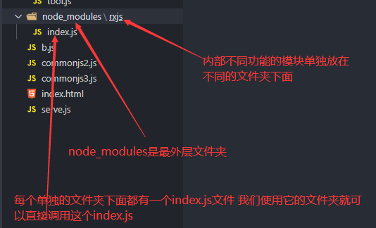
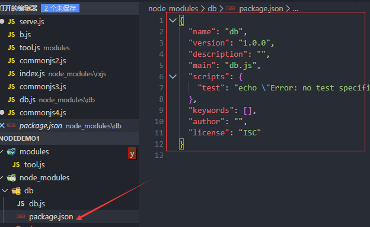
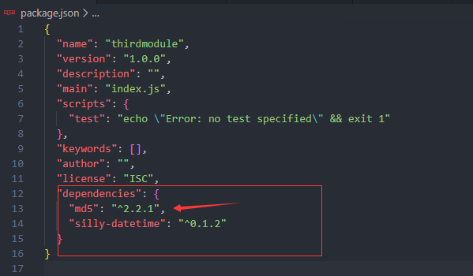
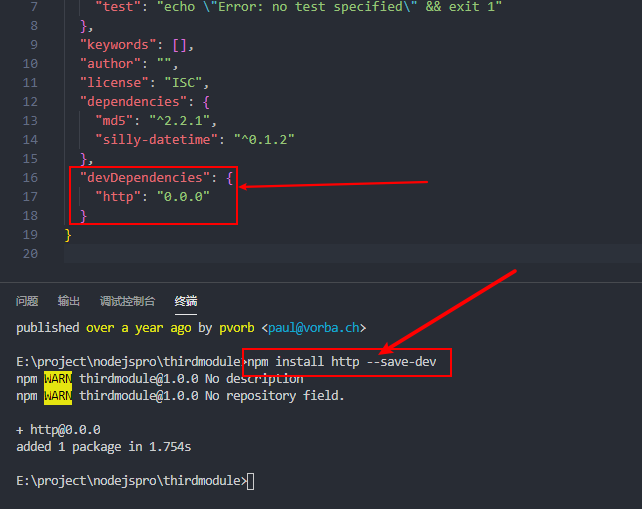
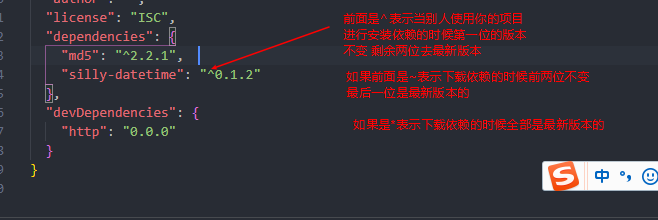

### supervisor

1. 管理工具  可以替代node命令 能够监视程序的更改状态  当内容发生改变的时候 会自动重新启动执行

   ```
   cnpm install -g supervisor
   supervosor 文件名.js
   ```

### 模块的概念module

1. 为了实现代码的复用  或者叫js里面的api接口 我们可以把一些能够重复使用的代码单独放在一个js文件里面  这个js文件就可以理解成是js的模块 这也就是Commonjs的初衷  但是这个模块文件js里面的内容默认对外是私有的 因此 如果在外部想要使用内部的属性或者方法 可以使用exports把对应的内容暴露 然后在需要的地方通过require方法进行被引入

   ```js
   暴露
   let obj={
       get:function(){
           console.log('从服务器获取数据');
       },
       post:function(){
           console.log('提交数据到服务器');
       }
   }
   exports.fun2=obj;
   //module.exports=obj
   ```

   ```js
   导入
   let req=require('./modules/tool');
   ```

2. nodejs的模块设计  一般我们把模块放在node_modules这个文件夹中 然后不同的模块再分别创建不同的子文件夹 在子文件夹中创建index.js这样子 我们在nodejs中使用路劲的时候直接使用对应的子文件夹的名字就可以导入对应的文件夹下面的index.js

   

   ​	

   

3. 我们可以使用第三方的包 使用npm或者cnpm进行安装 

   ```
   npm install  md5 --save   加上--save表示会在package.json文件中添加你下载的包信息作为项目的依赖 此时别人用你的项目的时候可以cnpm install安装
   
   ```

   

4. 有时候我们也需要下载一些工具的模块 

   ```
   npm install -g md5  --save-dev此时会把项目的依赖信息天剑到  package.json的devdependcies参数下
   ```

   

   ​		

5. 


